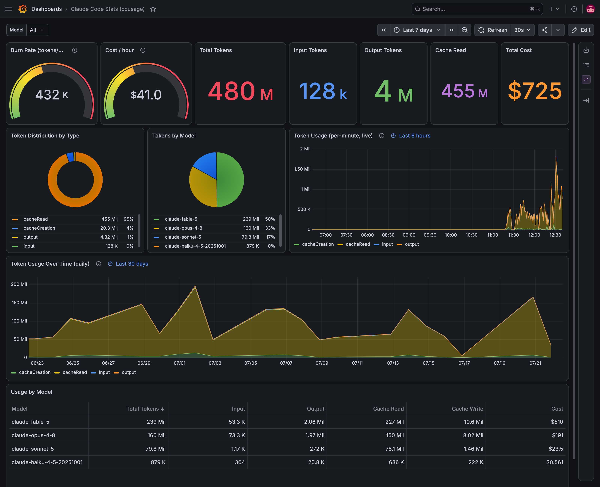
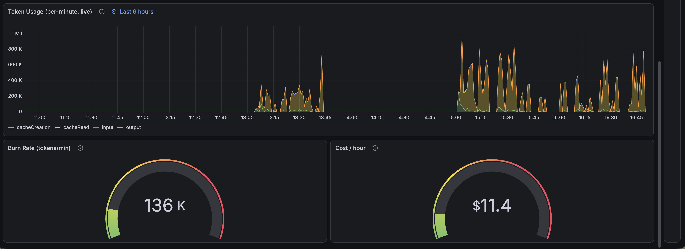

# claude-monitor

A local Grafana dashboard for your Claude Code token usage and cost, built on
[`ccusage`](https://github.com/ryoppippi/ccusage). Everything runs in Docker —
no data leaves your machine except optional live model-pricing lookups.



Plus a live, per-minute view with burn-rate and cost-per-hour gauges:



## How it works

- **`ccusage-http`** — a tiny Node bridge that runs `ccusage` against your
  `~/.claude` logs and republishes the results as JSON on port `3001`.
- **`grafana`** — Grafana with the Infinity datasource plugin, pre-provisioned
  with a datasource and the `ccusage` dashboard, on port `3000`.

The dashboard talks to the bridge over Docker's internal network
(`http://ccusage-http:3001`), so nothing is hardcoded to a specific machine.

## Prerequisites

- Docker + Docker Compose
- Claude Code installed, with usage logs in `~/.claude` (the default)

## Run it

```bash
git clone git@github.com:johnathafelix/claude-monitor.git
cd claude-monitor
docker compose up -d
```

Then open **http://localhost:3000** (login `admin` / `admin`) and pick the
**ccusage** dashboard.

To stop: `docker compose down` (add `-v` to also wipe Grafana's stored state).

## Notes

- The compose file mounts `${HOME}/.claude` read-only, so it works on any
  machine where you use Claude Code without editing paths.
- If your Claude logs live somewhere else (e.g. `~/.config/claude`), change the
  volume mount for `ccusage-http` in `docker-compose.yml`.
- Live pricing needs network egress. Set `CCUSAGE_OFFLINE=1` on the
  `ccusage-http` service to force the bundled price snapshot.
- Change the Grafana admin password via `GF_SECURITY_ADMIN_PASSWORD` in
  `docker-compose.yml` if you expose this beyond localhost.
