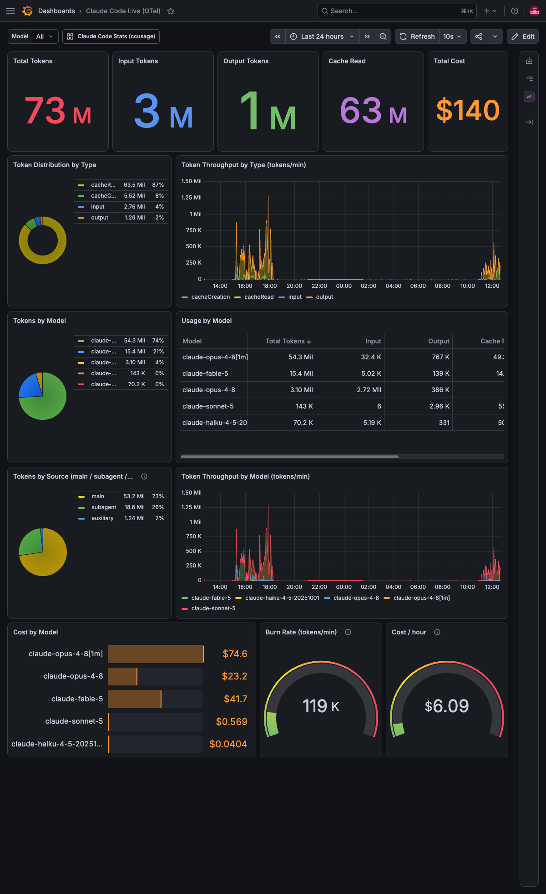

# claude-monitor

A local Grafana dashboard for your Claude Code token usage and cost, built on
[`ccusage`](https://github.com/ryoppippi/ccusage). Everything runs in Docker —
no data leaves your machine except optional live model-pricing lookups.


Plus a live, per-minute view with burn-rate and cost-per-hour gauges:


## How it works

- **`ccusage-http`** — a tiny Node bridge that runs `ccusage` against your
  `~/.claude` logs and republishes the results as JSON on port `3001`.
- **`grafana`** — Grafana with the Infinity datasource plugin, pre-provisioned
  with a datasource and the `ccusage` dashboard, on port `3000`.
- **`otel-collector` + `prometheus`** — an OTLP sink (gRPC `4317` / HTTP `4318`)
  for Claude Code's built-in OpenTelemetry export, scraped by Prometheus and
  shown on the **Claude Code Live (OTel)** dashboard. Unlike the transcript
  logs, this path counts *every* API request the client makes — including
  background/auxiliary calls such as the auto-mode classifier.

The dashboard talks to the bridge over Docker's internal network
(`http://ccusage-http:3001`), so nothing is hardcoded to a specific machine.

## Two data sources, two dashboards

| | ccusage (transcripts) | OTel (client telemetry) |
|---|---|---|
| History | Full (as far back as your logs go) | Only sessions started after enabling |
| Background/classifier calls | Missing | Included (`query_source="auxiliary"`) |
| Latency | ~30s cache over log files | Export interval (10s) |

Keep using the ccusage dashboard for history; the OTel dashboard is the live,
complete view going forward. It mirrors the ccusage dashboard's cards, charts,
and layout — with a per-model filter, a live burn-rate/cost gauge pair, and a
`query_source` breakdown that surfaces the background/classifier usage:



### Enabling Claude Code telemetry

Add this to the `env` block of `~/.claude/settings.json` (new sessions pick it
up automatically):

```json
{
  "env": {
    "CLAUDE_CODE_ENABLE_TELEMETRY": "1",
    "OTEL_METRICS_EXPORTER": "otlp",
    "OTEL_EXPORTER_OTLP_METRICS_ENDPOINT": "http://localhost:4317",
    "OTEL_EXPORTER_OTLP_METRICS_PROTOCOL": "grpc",
    "OTEL_METRIC_EXPORT_INTERVAL": "10000"
  }
}
```

> **Coexisting with org-managed telemetry.** If your organization pushes
> remote managed settings that already configure OTel export (check
> `~/.claude/remote-settings.json`), don't set the generic
> `OTEL_EXPORTER_OTLP_ENDPOINT` yourself — that could also redirect the org's
> logs/events export away from their endpoint. The snippet above uses the
> **signal-specific metrics variables** instead: metrics flow to the local
> collector while logs/events keep flowing to the org endpoint. Verified
> working with both configured simultaneously.

The Prometheus metric names carry OpenMetrics suffixes:
`claude_code_token_usage_tokens_total` (labels: `model`, `type`,
`query_source`, `session_id`) and `claude_code_cost_usage_USD_total`.

## Prerequisites

- Docker + Docker Compose
- Claude Code installed, with usage logs in `~/.claude` (the default)

## Run it

```bash
git clone git@github.com:johnathafelix/claude-monitor.git
cd claude-monitor
docker compose up -d
```

Then open **http://localhost:3000** (login `admin` / `admin`) and pick the
**ccusage** dashboard.

To stop: `docker compose down` (add `-v` to also wipe Grafana's stored state).

## Notes

- The compose file mounts `${HOME}/.claude` read-only, so it works on any
  machine where you use Claude Code without editing paths.
- If your Claude logs live somewhere else (e.g. `~/.config/claude`), change the
  volume mount for `ccusage-http` in `docker-compose.yml`.
- Live pricing needs network egress. Set `CCUSAGE_OFFLINE=1` on the
  `ccusage-http` service to force the bundled price snapshot.
- Change the Grafana admin password via `GF_SECURITY_ADMIN_PASSWORD` in
  `docker-compose.yml` if you expose this beyond localhost.
