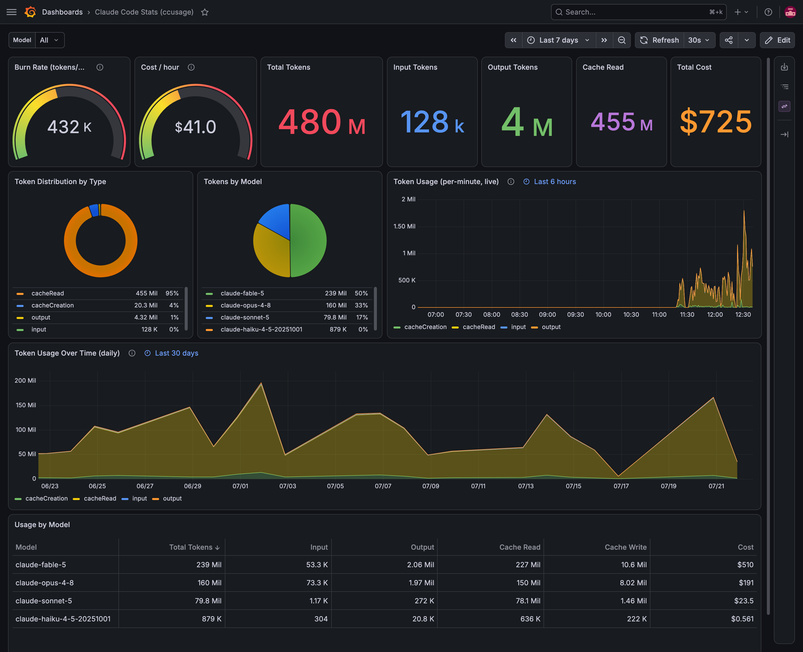
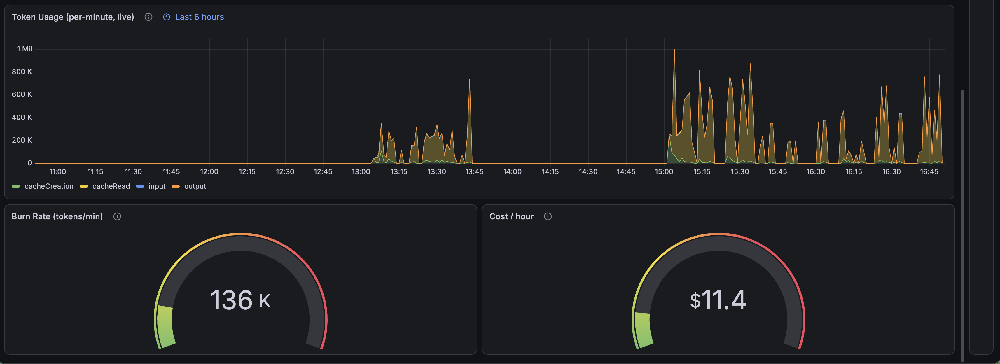
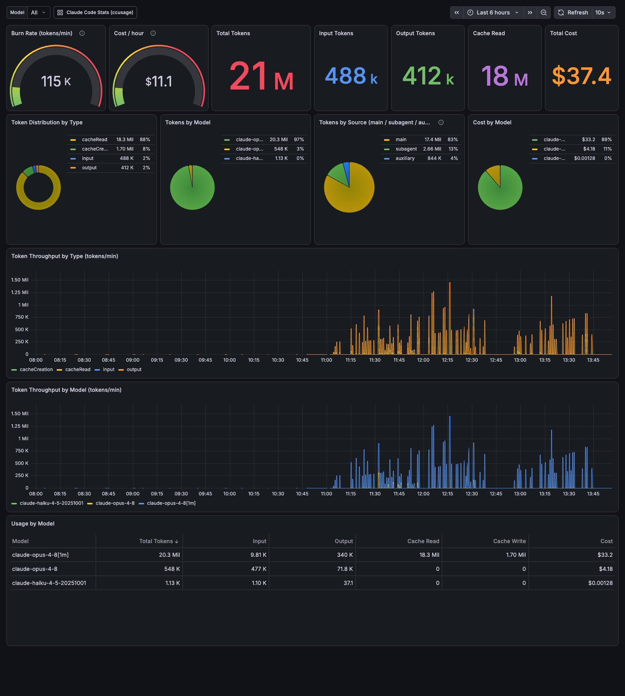

# claude-monitor

A local Grafana dashboard for your Claude Code token usage and cost, built on
[`ccusage`](https://github.com/ryoppippi/ccusage). Everything runs in Docker —
no data leaves your machine except optional live model-pricing lookups.



Plus a live, per-minute view with burn-rate and cost-per-hour gauges:



## How it works

- **`ccusage-http`** — a tiny Node bridge that runs `ccusage` against your
  `~/.claude` logs and republishes the results as JSON on port `3001`.
- **`grafana`** — Grafana with the Infinity datasource plugin, pre-provisioned
  with a datasource and the `ccusage` dashboard, on port `3035`.
- **`otel-collector` + `prometheus`** — an OTLP sink (gRPC `4317` / HTTP `4318`)
  for Claude Code's built-in OpenTelemetry export, scraped by Prometheus and
  shown on the **Claude Code Live (OTel)** dashboard. Unlike the transcript
  logs, this path counts *every* API request the client makes — including
  background/auxiliary calls such as the auto-mode classifier.
- **`usage-archive` + `mongo`** — a background ingestor that archives *all*
  `~/.claude` data into MongoDB (persistent volumes) and serves the
  **Claude Code Archive (Mongo)** dashboard from indexed queries on port
  `3002`. Every transcript line of every session — including subagent
  transcripts and their meta files, plus `stats-cache.json`, `history.jsonl`
  and `metrics/events/` — is stored raw, so history survives Claude Code's
  ~30-day transcript retention and future dashboards can be built without
  re-parsing files. Usage metrics are deduped by `message.id:requestId` — the
  same key ccusage uses, with the **last** occurrence winning: Claude Code
  re-appends a streamed message up to a dozen times and each re-append carries
  *larger* usage numbers than the one before, so first-write-wins would
  undercount. Cache-write tokens come from the `cache_creation` ephemeral TTL
  split (`5m + 1h`), which is what gets priced per-TTL and occasionally
  disagrees with the flat `cache_creation_input_tokens` field. Costs are
  computed from **dated** LiteLLM pricing snapshots persisted in Mongo — past
  usage keeps the price that was in effect at the time, and new models get
  re-priced automatically once LiteLLM publishes their rates.

The dashboards talk to the bridges over Docker's internal network
(`http://ccusage-http:3001`, `http://usage-archive:3002`), so nothing is
hardcoded to a specific machine.

## Three data sources, three dashboards

| | ccusage (transcripts) | OTel (client telemetry) | Archive (Mongo) |
|---|---|---|---|
| History | As far back as your logs go | Only sessions started after enabling | Everything ever ingested (survives log retention) |
| Background/classifier calls | Missing | Included (`query_source="auxiliary"`) | Missing (not in transcripts) |
| Subagent breakdown | No | main/subagent split | main/subagent + per-agent-type |
| Latency | ~30s cache over log files | Export interval (10s) | ≤60s scan interval |
| Query cost | Re-parses logs per refresh | Prometheus TSDB | Indexed Mongo aggregations |

The Archive dashboard mirrors the OTel dashboard's layout and adds a live
model-pricing table. Mongo is reachable from the host at
`mongodb://127.0.0.1:37017/usage_archive?directConnection=true` for ad-hoc
queries (mongosh/Compass); the raw per-line archive lives in `raw_entries`,
deduped billable events in `usage_events`, dated prices in
`pricing_snapshots`, and the backfilled sources in `stats_daily`,
`stats_models`, `prompt_history`, `cc_events` and `subagent_meta`.

The first ingest is the slow one — roughly 400 MB across ~2,000 transcript
files takes about 70s — after which each 60s cycle reads only the bytes
appended since the last pass, so restarts re-ingest nothing.

### Does the archive agree with ccusage?

For closed (fully elapsed) windows, yes: `/summary` matches `ccusage` exactly
on all four token fields and the total, with cost equal to 10 decimals, and
`/timeseries` and `/models` are byte-identical to the `ccusage-http` responses.

One endpoint diverges by design. `/blocks-series` keeps the **final** usage for
each streamed message, so the per-minute series sums exactly to the daily
totals; ccusage's own per-minute view keeps the first partial snapshot instead,
which is why the live minute charts can differ slightly between the two
dashboards even though their daily totals agree.

Keep using the ccusage dashboard for history; the OTel dashboard is the live,
complete view going forward. It mirrors the ccusage dashboard's cards, charts,
and layout — with a per-model filter, a live burn-rate/cost gauge pair, and a
`query_source` breakdown that surfaces the background/classifier usage:



### Enabling Claude Code telemetry

Add this to the `env` block of `~/.claude/settings.json` (new sessions pick it
up automatically):

```json
{
  "env": {
    "CLAUDE_CODE_ENABLE_TELEMETRY": "1",
    "OTEL_METRICS_EXPORTER": "otlp",
    "OTEL_EXPORTER_OTLP_METRICS_ENDPOINT": "http://localhost:4317",
    "OTEL_EXPORTER_OTLP_METRICS_PROTOCOL": "grpc",
    "OTEL_METRIC_EXPORT_INTERVAL": "10000"
  }
}
```

> **Coexisting with org-managed telemetry.** If your organization pushes
> remote managed settings that already configure OTel export (check
> `~/.claude/remote-settings.json`), don't set the generic
> `OTEL_EXPORTER_OTLP_ENDPOINT` yourself — that could also redirect the org's
> logs/events export away from their endpoint. The snippet above uses the
> **signal-specific metrics variables** instead: metrics flow to the local
> collector while logs/events keep flowing to the org endpoint. Verified
> working with both configured simultaneously.

The Prometheus metric names carry OpenMetrics suffixes:
`claude_code_token_usage_tokens_total` (labels: `model`, `type`,
`query_source`, `session_id`) and `claude_code_cost_usage_USD_total`.

## Prerequisites

- Docker + Docker Compose
- Claude Code installed, with usage logs in `~/.claude` (the default)

## Run it

```bash
git clone git@github.com:johnathafelix/claude-monitor.git
cd claude-monitor
docker compose up -d
```

Then open **http://localhost:3035** (login `admin` / `admin`) and pick the
**ccusage** dashboard.

To stop: `docker compose down` (add `-v` to also wipe Grafana's stored state).

## Notes

- The compose file mounts `${HOME}/.claude` read-only, so it works on any
  machine where you use Claude Code without editing paths.
- If your Claude logs live somewhere else (e.g. `~/.config/claude`), change the
  volume mount for `ccusage-http` in `docker-compose.yml`.
- Live pricing needs network egress. Set `CCUSAGE_OFFLINE=1` on the
  `ccusage-http` service to force the bundled price snapshot.
- Change the Grafana admin password via `GF_SECURITY_ADMIN_PASSWORD` in
  `docker-compose.yml` if you expose this beyond localhost.
